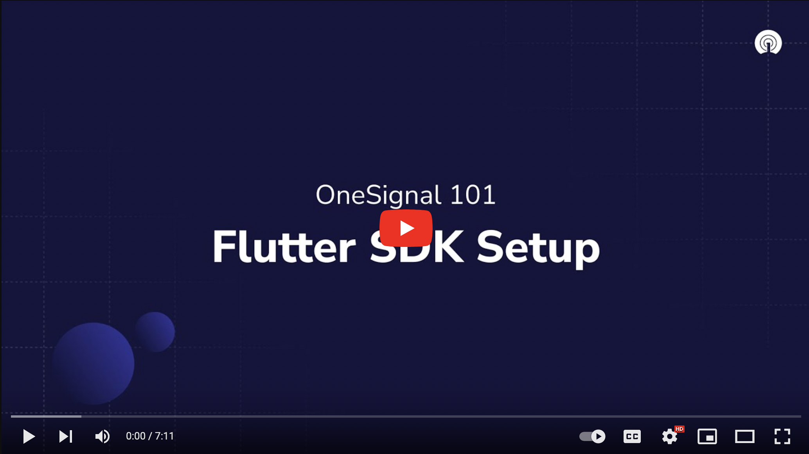

  <a href="https://documentation.onesignal.com/docs/onboarding-with-onesignal" target="_blank">Quickstart</a>
  &nbsp;&nbsp;•&nbsp;&nbsp;
  <a href="https://onesignal.com/" target="_blank">Website</a>
  &nbsp;&nbsp;•&nbsp;&nbsp;
  <a href="https://documentation.onesignal.com/docs" target="_blank">Docs</a>
  &nbsp;&nbsp;•&nbsp;&nbsp;
  <a href="https://github.com/OneSignalDevelopers" target="_blank">Examples</a>
   
  

OneSignal makes engaging customers simple and is the fastest, most reliable service to send push notifications, in-app messages, SMS, and emails.

---

# OneSignal + Supabase Sample Integration App

This repo contains the companion app to the [Onesignal + Supabase Sample Integration guide](https://github.com/onesignaldevelopers/onesignal-supabase-sample-integration-supabase).

⚠️⚠️ Follow the integration guide to succesfully test the integration end-to-end. The [Supabase](https://github.com/onesignaldevelopers/onesignal-supabase-sample-integration-supabase) and [Next.js](https://github.com/onesignaldevelopers/onesignal-supabase-sample-integration-api) projects must be running first.

## 🚦 Getting Started

1. Run `cp .env.example .env.local` to duplicate the environment file template and set their values based on what you setup in the [integration guide](https://github.com/onesignaldevelopers/onesignal-supabase-sample-integration-supabase).
2. Todo: Update bundle identifier
3. Todo: Update app group
4. todo: Update merchant identifier
5. Run `flutter start` to launch the app on your device or emulator (iOS Simulator doesn't support push notifications).

## 👀 Looking For a Getting Started With Flutter Guide?

### We have other guides to help get your started

* [OneSignal SDK + Flutter Integration Sample](https://github.com/OneSignalDevelopers/OneSignal-Flutter-Sample)
* [OneSignal + Flutter Push Sample](https://github.com/OneSignalDevelopers/OneSignal-Flutter-Push-Sample)
* [Flutter SDK Setup](https://documentation.onesignal.com/docs/flutter-sdk-setup)

---

# ❤️ Developer Community

For additional resources, please join the [OneSignal Developer Community](https://onesignal.com/onesignal-developers).

Get in touch with us or learn more about OneSignal through the channels below.

- [Follow us on Twitter](https://twitter.com/onesignaldevs) to never miss any updates from the OneSignal team, ecosystem & community
- [Join us on Discord](https://discord.gg/EP7gf6Uz7G) to be a part of the OneSignal Developers community, showcase your work and connect with other OneSignal developers
- [Read the OneSignal Blog](https://onesignal.com/blog/) for the latest announcements, tutorials, in-depth articles & more.
- [Subscribe to us on YouTube](https://www.youtube.com/channel/UCe63d5EDQsSkOov-bIE_8Aw/featured) for walkthroughs, courses, talks, workshops & more.
- [Follow us on Twitch](https://www.twitch.tv/onesignaldevelopers) for live streams, office hours, support & more.

## Show your support

Give a ⭐️ if this project helped you, and watch this repo to stay up to date.

